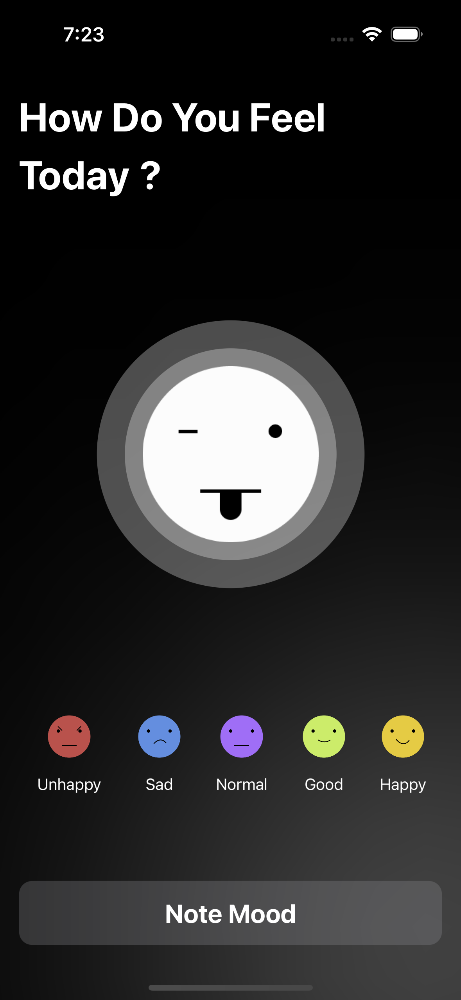
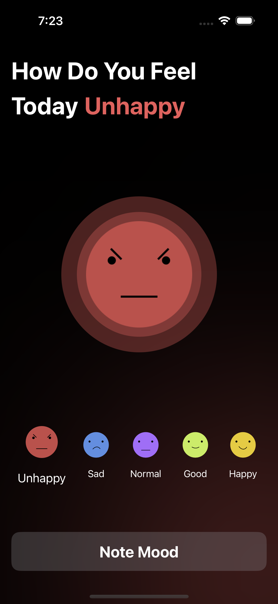
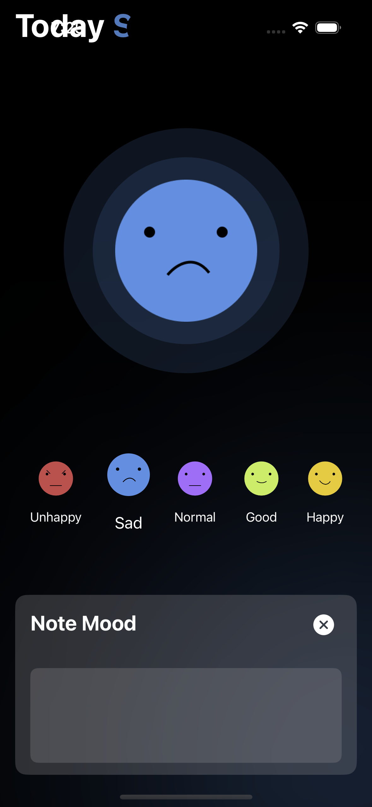
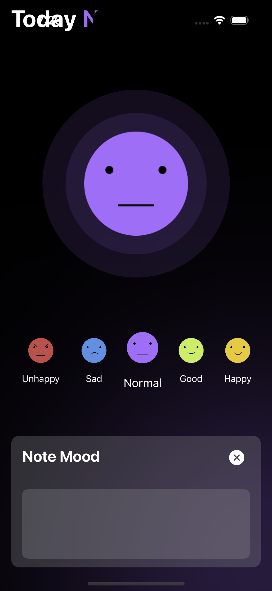
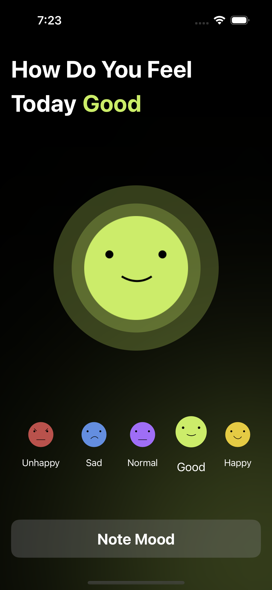
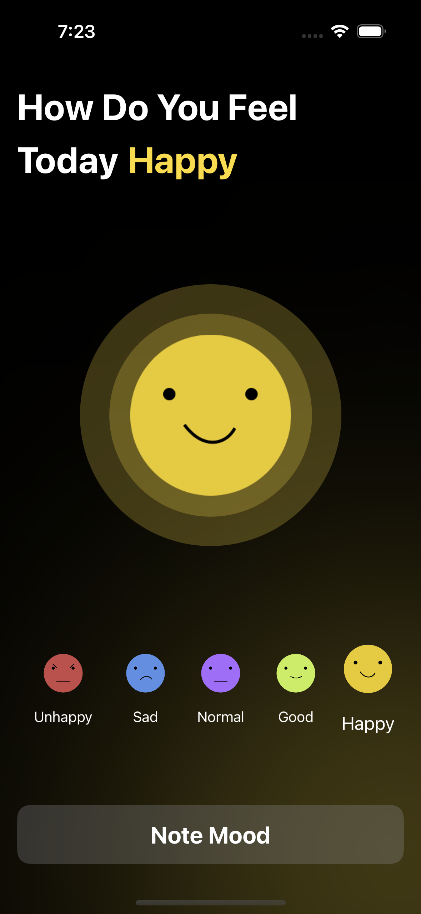
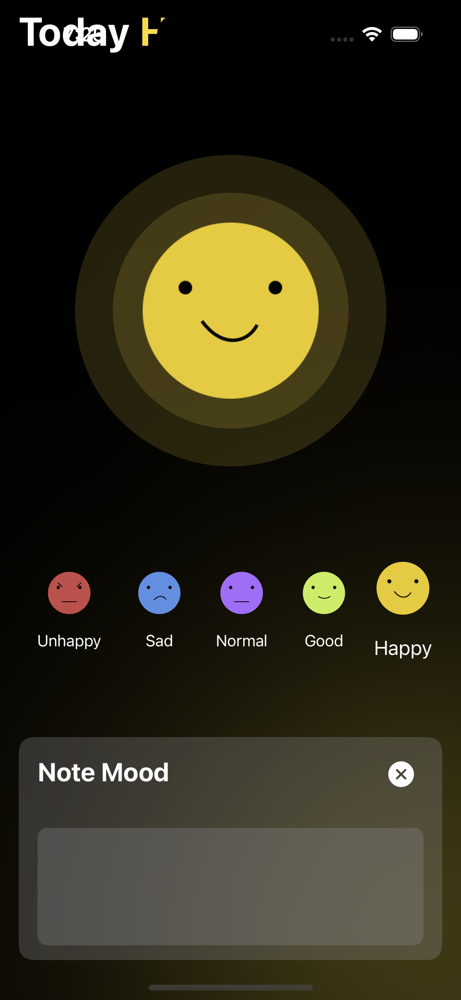

# Mood Tracker

Sample Application learning about animation and SwiftUI demonstrating how swiftui makes it easy to create animations.

## Screenshots

It was fun to create this application. The turorial can be found [here](https://www.youtube.com/watch?v=A43wDcpkUoc)
